# Documentation for Version 2
The document below describes a step-by-step guide on how to reproduce the visualization.  
  
**Step 1: Retrieving the datasets**  
Download the following datasets:  

1.	Violations dataset: https://data.cityofchicago.org/Transportation/Speed-Camera-Violations/hhkd-xvj4
2.	Locations dataset: https://data.cityofchicago.org/Transportation/Speed-Camera-Locations/4i42-qv3h
3.	Per Capita Income dataset: https://data.cityofchicago.org/Health-Human-Services/Per-Capita-Income/r6ad-wvtk
  
**Step 2: Load Violations dataset**  
In a new Workbook, we first begin by importing the violations dataset. In the Data Source tab, click `Add` under Connections, browse to the location of the violations dataset (which you downloaded in **Step 1**).  
Once it is loaded, we can proceed to creating our first chart.  
    
**Step 3: Creating the Violations by Year chart**  
In a new Sheet, drag `Violation Date` dimension to Columns and `Violations` measures to Rows.   
Add `Violation Date` to the Filters pane and select Edit Filter. In the option window, select years 2014 – 2018 and click on OK. The year 2019 is excluded as it is still on going.  

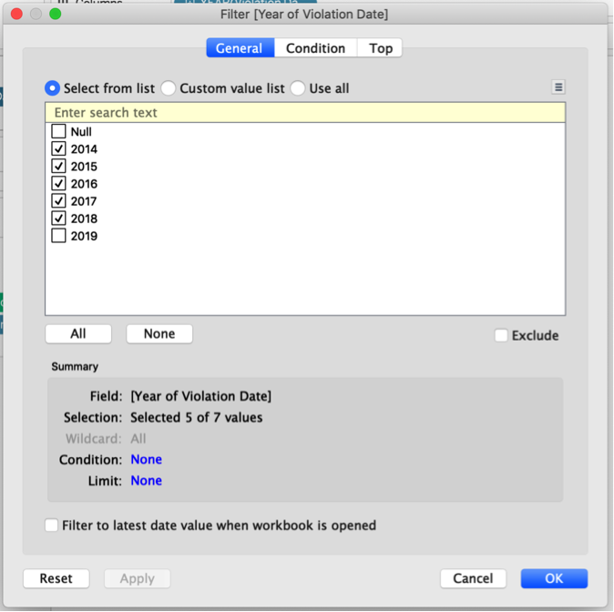

In the _Marks_ pane, select Bar if the auto generated chart is not of Bar type.  
Also drag `Violations` measures to the Label field under _Marks_.  
To change the colours of the bars, in the _Marks_ pane, click on Color > Edit Color.  
For this visualization, I selected the dark orange to represent number of violations.  
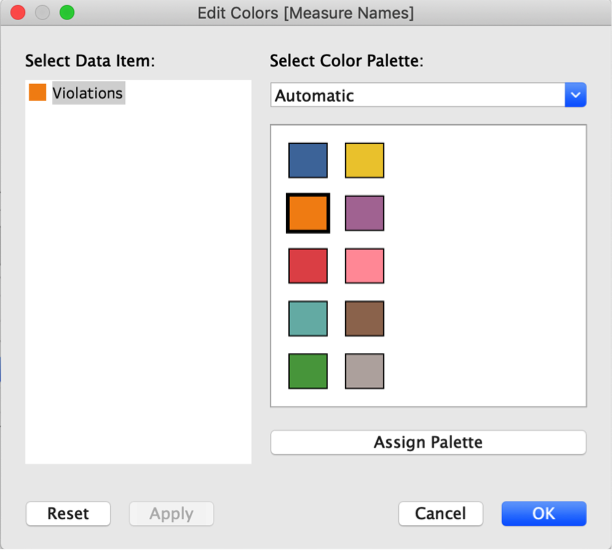  
Lastly, we rename the Sheet to “Violations by Year (2014 – 2018)”.  
The completed chart:  
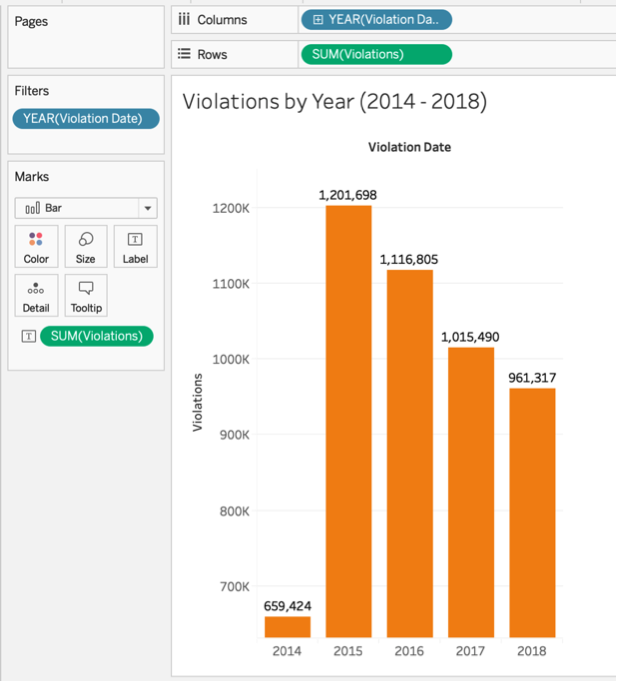  
  
**Comments**: The above chart shows us the total number of violations issued for each year between the years of 2014 – 2018. As we can see from the chart, there is a declining pattern in violations being issued, with the highest being in 2015 at over 1.2 million violations issued. While the decline may indicate the program having a positive outcome – having drivers drive slower in Children Safety Zones, there is no sure way of confirming it from this chart alone as the decline may be due to other factors, and will not be further explored in this project.  
  
Since we know the number of violations being issued from the program, I wanted to analyse how much the city was expected to make in revenue from the program. Is it feasible, economically, for the city to continue on the program? How much does the program’s revenue contribute to the maintenance of the City’s Park and Children’s programs?  
  
**Step 4: Creating the Estimated Fines per Year chart**  
To calculate the estimated fines, we need to know what is the fine per violation, which is not provided in the dataset. However, reports on the program indicates a $35 fine for speed violations up to 10mph from the posted speed limit and a $100 fine for speed violations above 10mph from the posted speed limit.
Using this knowledge, set up a _Parameter_ by right-clicking in the data pane area and selecting Create > Parameter. Name is as `Violation Fines` with float datatype and a List allowable type.  
Under List of values, insert the following values:  
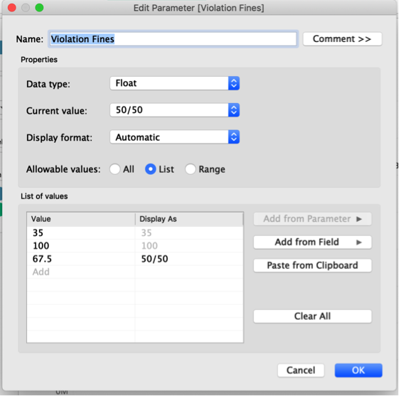
   
Click on OK to create the parameter. Once created, your new parameter will appear in the Parameter pane on the bottom left of the screen.  
  
Next, create a new calculated field called `Fines Estimate` by right-clicking on the measures area and selecting Create > Calculated Field. Enter the following calculation and click OK.  
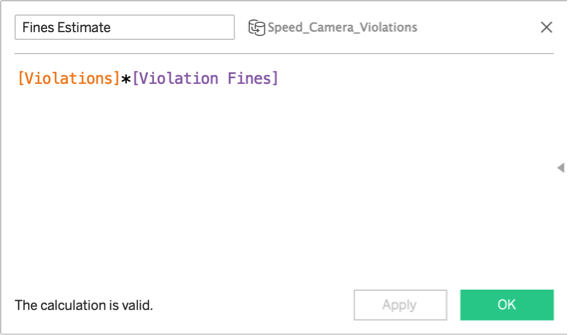  
I also created a second calculated field called `Estimated Collected Fines` to calculate the amount in fines the city can expected to collect with allowable 10% bad debt.  
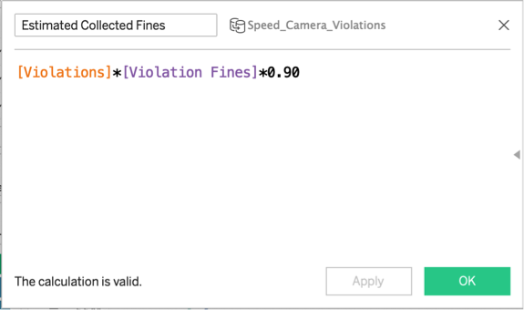  
  
On a new sheet, drag `Violation Date` to Columns and the newly created `Fines Estimate` measure to Rows. Once again, we filter the `Violation Date` to only 2014 – 2018 and drag the measure `Fines Estimate` to Label.  
Change the chart type to Line in the _Marks_ pane.  
To format the labels as currency, right-click on a label and select Format. In the format pane, which appeared on the left of the screen, change the Fields to `SUM(Collected Fines)`. Under Defaults, Totals and Grand Totals, Change the Numbers dropdown to Currency (Standard).  

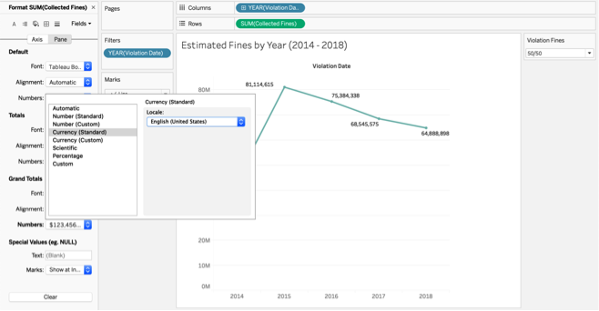  
You should now see your labels appearing as currency in the chart area.
Update the sheet name to ‘Estimated Fines by Year (2014 - 2018)’ and rename the y-axis label to “Estimates Fines (USD)”. You can rename the axis label by right-clicking on the y-axis and select Edit Axis…
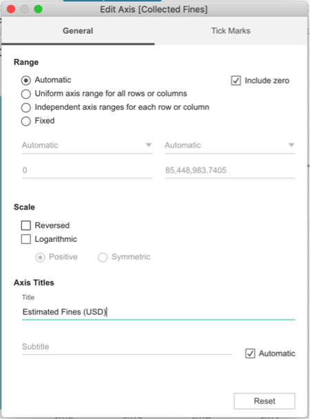  
Set the colour for the line to be blue for standardization throughout all the visualizations. For this project, I have selected blue to represent fines.  
You can choose to display the parameter control for `Violation Fines` to see the minimum, mean and maximum estimated fines/revenue from the program for each year. To display the parameter control, simply right-clicking anywhere on the chart area, select Parameter > Violation Fines.
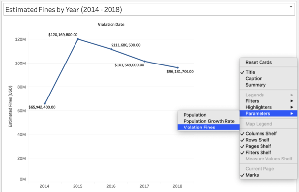  
If you would like to add a subtitle to the chart to explain that the estimated fines also equals to estimated revenue from the program, you can right-click the title and select “Edit Title”, give it a subheading.  
Additionally, to show a difference between the estimated fines from the violations and the estimated to be collected, drag `Estimated Collected Fines` to Columns and rename the axis labels. This would give you something like this:
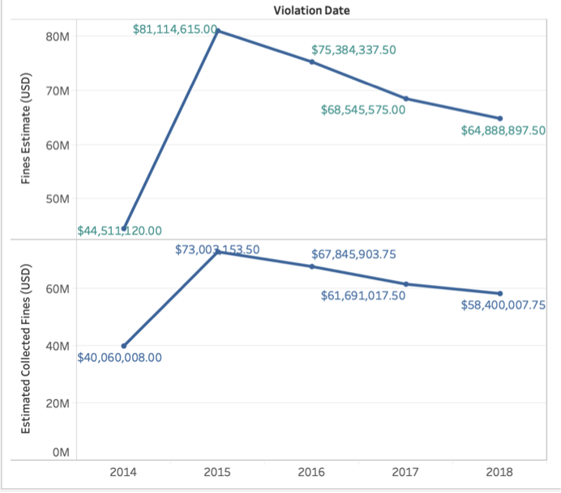  
To have both lines in the same chart, right-click on the y-axis of the, select “_Dual Axis_”. Then right-click once more on the right y-axis and select “_Synchronize Axis_”. Optionally, we can edit the axis to not include zero values. This allows us to zoom closer to the chart area and see the line patterns better.  
Since there is a declining trend in fines being collected, we would like to know the projected fines (revenue) for this year (2019) and next (2020). We can go to Analysis > Forecast > Show Forecast. This will show us the forecast amounts for the years 2019 and 2020, which can be used for the City’s budgeting in the next year.
  
Set the colours to differentiate between the different measures so that they can be clearly identified and ensure that no point labels overlap one another.  
  
The final chart will look like this:  
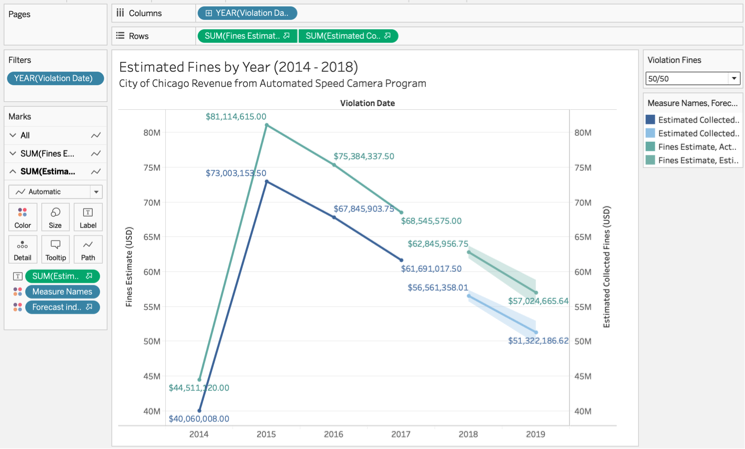  

**Comment**: I chose to include both the total estimated fines and also the estimated collections into the chart so that the reader would be able to know these figures, if needed. As mentioned previously, it is good to have the forecast for the coming years so that the city can have a rough estimate as a guide when preparing for the city’s budget. Toggling between the different values for `Violation Fines` will show the mininmum revenue (all fines are of $35) and maximum estimated revenue (all fines are $100). Unfortunately, in a chart that uses forecasting, Tableau does not allow us to also show Totals. Hence, that amount is manually calculated and included in the Story.  
  
**Step 5: Violations by Zipcode and Per Capita Income**  
From the data exploration phase, we know which cameras had the highest violations over the years. In version 1, I wanted to find the top 3 zipcodes that yielded the most in fines (revenue) and how they compare to the median per capita income of each zipcode.  
This requires for the dataset to be merged with a second dataset that had zipcode data (Location dataset). Prior to importing the Location dataset into Tableau, I had to fix the zipcode column of the original file downloaded from the source was incorrect. Using Google Map, I searched up the addresses to find the real zipcode for each camera. I also had to change the addresses to all uppercase for it to be matched as identical in Tableau. Using Excel’s _UPPER()_ function, I converted all the camera’s address to uppercase and saved the file.  
  
Once all the initial data cleanup is done, import the new datasets (Location and Per Capita Income) into Tableau. In the Data Source tab, add the new datasets and drag it to the existing Violations dataset. Edit the join conditions.  
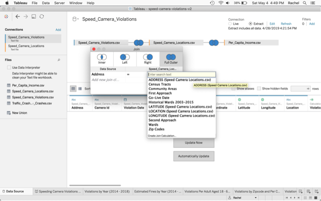  
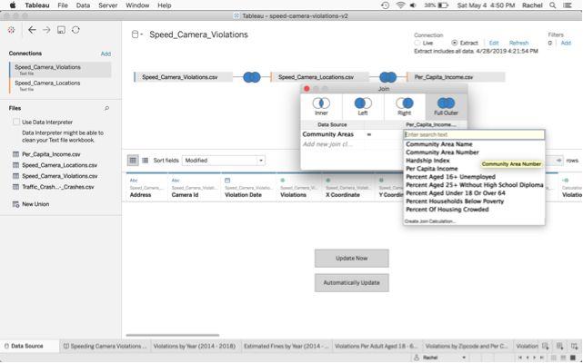  
In a new sheet, drag Zip Codes (ensure that the _geographic role_ is set to Zipcode) to Columns. Click on “Show Me” in the top right corner and select the Map visualization.  
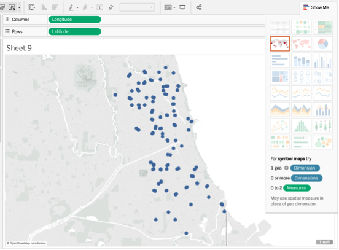  
In the _Marks_ pane, set  
**AVG(Per Capita Income)** to Color  
**SUM(Violations)** to Size  
**SUM(Fines Estimate)** to Tooltip  
**AVG(Per Capita Income)** to Label  
**SUM(Violations)** to Label  
**Zip Codes** to Detail  

Change the colour by clicking on the Color icon in the _Marks_ pane.  
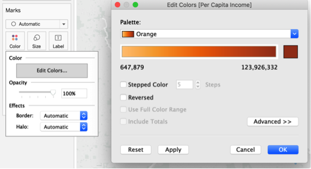  
Rename the sheet to “Violations and Fines Estimated by Zipcode and Per Capita Income YTD”. Right-click on the sheet name and select “Duplicate as Crosstab”. In the newly created sheet, sort the Violationsn column to descending order. Going back to the map, select the top three zipcodes. In the _Marks_ pane, click on Text and under _Marks_ to Label, select “Selected”.  
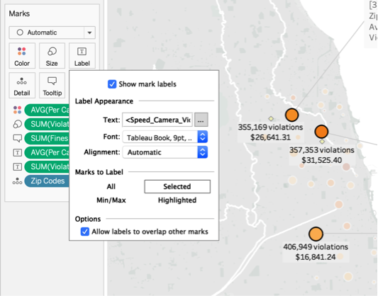  
Right-click on the top three zipcodes and select Mark Label > Always Show. Also select Annotate > Mark. Edit the text to be displayed accordingly.  
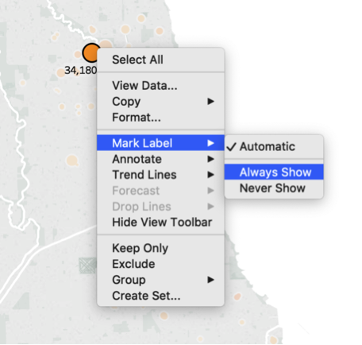  
Change SUM(Per Capita Income) to display as currency (standard).  
The final visualization looks like this:  
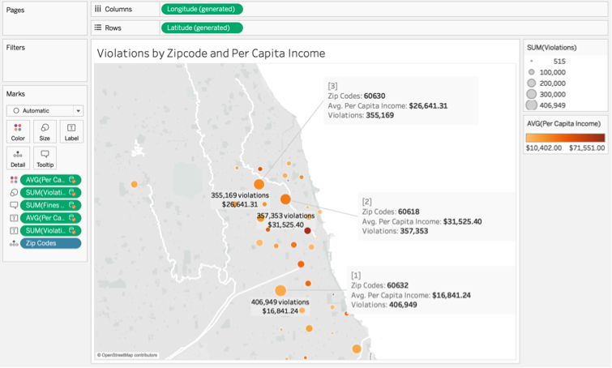  
  
**Comment**: In this chart, from the top 3 zipcodes with the highest amount of violations being issued, we can see that the total fines year to date since the launch of the program, amounts to near equal or exceeds the median income for residents in the area. Bearing in mind that residents are also being issued fines from other traffic offenses such as running a red light, parking, etc. Hence, from this visualization, we can assume that these fines are bringing a heavy financial burden to many low to middle class residents, and perhaps may even lead them into having debts, although aside from news outlet reports, there is no data to help prove this claim is concrete in this visualization.  
  
**Step 6: Creating Violations Per Adult** 
As an additional chart, to see what the statistics were per adult in the City of Chicago, I created the Violations Per Adult Aged 18 – 64 years chart.
Create a Population parameter, setting the 2010 census data to be the minimum and **step s**ize of 10,000 per year (0.0425% annual population growth).  
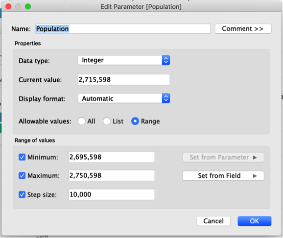  

Create a new Calculated Field called `Fines Per Adult`. Since we only taking into account adults between the ages 18 – 64, we exclude the percentage of population for all other age groups from our calculation.  
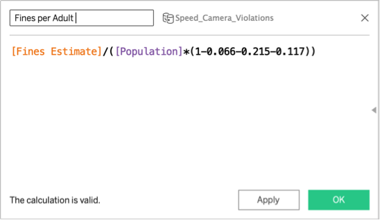  
In a new sheet, drag `Violation Date` to Column and `SUM(Violations)` and `SUM(Fines Per Adult)` to Rows. Filter the year to just 2014 – 2018.  
Right-click on the y-axis and select “Dual Axis” so that both lines appear on the same chart. For this chart, we cannot synchronize the axis as they are of different units. We do however, standardize the colours for the lines, so that they are the same as the previous charts.  
Optionally, we can choose to show the parameter controls for the Population parameter, which allows the reader to adjust the population to the be used with the calculation.  
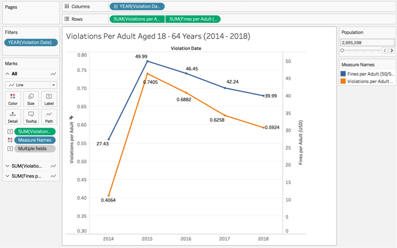  
  
Once all the charts have been created, compile them into a story.  
  
**Step 7: Putting the Story Together**  
Create a new Story and insert “City of Chicago’s Speed Camera Violations and Fines” for the title. To add a new story point, click on Blank. Drag the charts one by one to a story point. Add text on each story point to describe the insight/analysis of each of the charts. You can also fill in a short sumary/introduction to the visualization in the Caption boxes on the top.  
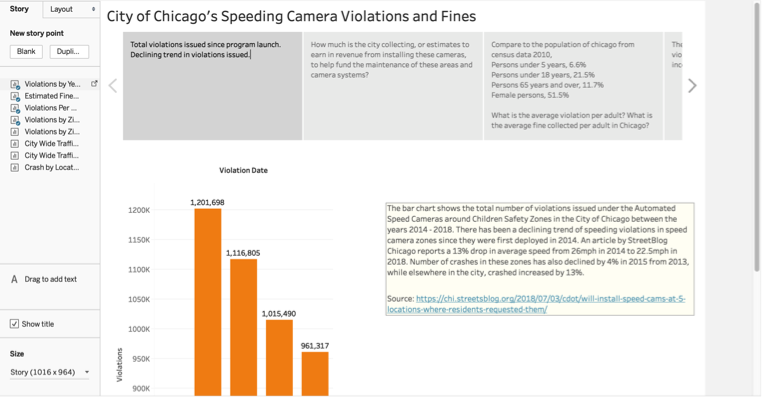  
  
**Step 8: Publishing to Tableau Public**
Save the file.  
If you would like to publish the file to Tableau Public, first extract the dataset by going to the Data Source tab, and select “Extract”. A prompt will pop up to ask where you would like to store the extracted file.  
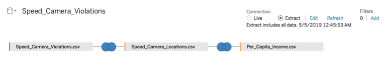  
To publish the file to Tableau Public, ensure that you are signed in to your account and select Server > Tableau Public > Save to Tableau Public. This process may take a few minutes, depending on your dataset size. Once it has been uploaded successfully, Tableau will be lauched in your web browser. You may view it and make any publishing changes to it.  
  
The final visualization can be found here: https://public.tableau.com/views/speed-camera-violations-v2/SpeedingCameraViolationsandFines?:embed=y&:display_count=yes&publish=yes
  
  
